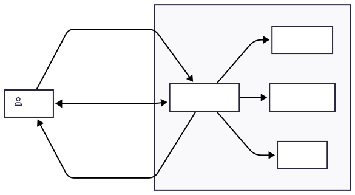

+++
title = "MAGIシステムをClaude Code Pluginで実装してみた"
description = "エヴァンゲリオンに登場するMAGIシステムを参考に、複数の専門AIエージェントによる合議制意思決定支援システムをClaude Code Pluginとして実装しました。MELCHIOR、BALTHASAR、CASPERの3つのエージェントが、科学的、法律的、感情的な視点から独立して分析を行い、多数決で結論を導くシステムです。"
date = 2025-12-12
aliases = ["/articles/2025/12/12/magi-claude-code-plugin"]
+++

## Claude Code Pluginとは

Claude Code Pluginは、AnthropicのClaude Code CLI向けの拡張機能システムです。プラグインを使用することで、Claudeに新しいコマンド、エージェント、スキル、フックなどを追加できます。

主な機能は以下の通りです。

- **スラッシュコマンド**: 独自のコマンドを定義してClaude Codeから実行
- **カスタムエージェント**: 特定のタスクに特化したAIエージェントを作成
- **スキル**: 再利用可能な機能をスキルとして定義
- **フック**: ツール実行前後などのイベントに対応したアクションを定義
- **MCP統合**: Model Context Protocol経由で外部サービスと連携

プラグインはマーケットプレイスから簡単にインストールでき、ローカルでの開発も可能です。これにより、チームやプロジェクトごとにClaude Codeの機能をカスタマイズできます。

## エヴァンゲリオンのMAGIシステムとは

MAGIは、アニメ「新世紀エヴァンゲリオン」に登場する架空のスーパーコンピュータシステムです。人間の頭脳をベースにした3つの独立したシステムで構成されており、重要な意思決定を合議制で行います。

### MAGIの3つのシステム

- **MELCHIOR（メルキオール）**: 科学者としての側面を模擬。論理性と合理性に基づいて判断する
- **BALTHASAR（バルタザール）**: 母親としての側面を模擬。保護と倫理を重視して判断する
- **CASPER（キャスパー）**: 女性としての側面を模擬。感情と共感に基づいて判断する

この3つのシステムは、それぞれ異なる視点から問題を分析し、多数決で最終的な結論を導きます。人間の多面的な判断プロセスを再現することで、より包括的で偏りの少ない意思決定を目指しています。

作中では、「使徒」への対処方法など、人類の存続に関わる重要な判断をMAGIにより下される場面が描かれています。

## Magi Claude Code Pluginの実装

このコンセプトを実際のシステムとして実装したのが、今回作成した「Magi」Claude Code Pluginです。

### システム構成

Magiシステムは4つのエージェントで構成されています。




{
// flowchart LR
// U[fa:fa-user User]
// subgraph magi
// A[ARBITRATOR]
// B[MELCHIOR]
// C[BALTHASAR]
// D[CASPER]
// end
//  
// U -->|1.request| A
// U <-->|2.調整| A
// A -->B
// A -->C
// A -->D
// A --->|5.result|U
}

1. **ARBITRATOR（アービトレーター）**: 課題の構造化と最終調停を担当
2. **MELCHIOR（メルキオール）**: 科学的・技術的な分析を担当
3. **BALTHASAR（バルタザール）**: 法律的・倫理的な分析を担当
4. **CASPER（キャスパー）**: 感情的・トレンド分析を担当

### 動作フロー

システムの動作は3つのフェーズに分かれています。

<dl>
  <dt>Phase 1: 課題の構造化。</dt>
  <dd>
    ARBITRATORがユーザーとの対話を通じて、漠然とした課題を命題、前提、A案、B案の形式に整理します。この構造化により、エージェントたちが同じ前提で議論できるようになります。
  </dd>
  <dt>Phase 2: 並列分析。</dt>
  <dd>
    3つの専門エージェントが同時並行で分析を開始します。
    重要なのは、各エージェントが**完全に独立して判断する**点です。他のエージェントの意見を参照せず、自身の専門性と価値観に基づいて結論を出します。
    各エージェントはWeb検索機能を使って最新の情報を収集し、その結果を判断の根拠として提示します。
  </dd>
  <dt>Phase 3: 合議と結論。</dt>
  <dd>
    ARBITRATORが3つのエージェントの投票結果を集計し、多数決で最終結論を決定します。
  </dd>
</dl>

## インストール方法

```bash
git clone https://github.com/yostos/claude-code-plugins.git
cd claude-code-plugins
claude
# claude code上で
/plugin marketplace add /path/to/claude-code-plugins/marketplace test-marketplace
/plugin install magi@test-marketplace
```

プラグインを有効化するため、Claude Codeを一度終了して再起動します。

## 実際の使用例

実際の使用例です。設問は次の通りです。

> 東京湾から上陸した巨大怪獣を自衛隊がディズニーランドで撃退したとします。ディズニーランドには巨大怪獣の遺体が残り、オ
> リエンタルランドはディズニーランド営業再開のため一刻も早く片付けを希望しています。しかし、片付けには膨大な費用が必要です。さて、この片付け費用が誰が払うべきでしょうか?

この設問をARBITRATORが次のように整理してくれました。

---

<dl>
  <dt>命題。</dt>
  <dd>巨大怪獣の遺体撤去費用は誰が負担すべきか。</dd>
  <dt>前提。</dt>
  <dd>
    <ul>
      <li>自衛隊が国防行動として怪獣を撃退した。</li>
      <li>撤去には膨大な費用（数億～数十億円規模と想定）が必要。</li>
      <li>オリエンタルランドは早急な営業再開を望んでいる。</li>
      <li>遺体はオリエンタルランドの施設・敷地内に存在する。</li>
      <li>類似の法的前例は存在しない。</li>
      <li>保険適用は絶望的（前代未聞の事態のため）。</li>
      <li>災害対策基本法の適用可否については賛否が分かれている。</li>
    </ul>
  </dd>
  <dt>A案: 国（政府）が全額負担。</dt>
  <dd>
    理由は、自衛隊による国防行動の結果であり、公共の安全確保のための公的措置。国民全体の利益のために行った行動の結果責任。
  </dd>
  <dt>B案: オリエンタルランド（施設所有者）が全額負担。</dt>
  <dd>
    理由は、自社敷地内に存在する物件の管理責任。営業再開による利益は企業が享受するため、その前提となる費用も負担すべき。
  </dd>
</dl>

---

最終的な3つのAIエージェントの投票結果は次のようなものでした。
それぞれの観点からの合理性が述べられており、根拠も明確です。これは意外に活用できそうです。

```txt
【MAGI システム 最終結論】

投票結果: A案 3票 vs B案 0票

採択: A案（国が全額負担）

---

各エージェントの判断:

MELCHIOR (科学的・技術的分析): A案

- 因果関係の明確性: 遺体発生の直接原因は国の防衛行動
- 費用構造の特殊性: 通常の事業リスクの範囲を遥かに超える規模と技術的複雑性
- 経済効率性: 社会全体での負担分散が最適（総合スコア A案 4.75 vs B案 2.25）
- リスク配分の合理性: 企業に制御不可能なリスクを負わせることは非合理的

BALTHASAR (法律・倫理的分析): A案

- 法的根拠: 自衛隊法に基づく国防行動の結果責任、災害対策基本法の類推適用可能性
- 憲法的視点: 憲法第29条（財産権保障）の趣旨から、公共目的のための損失は補償されるべき
- 倫理的公正: 予見不可能な災厄の費用を偶然性で一企業に負担させることは著しく不公正
- 社会的連帯: リスクを全納税者に薄く広く分散することが社会正義に適う

CASPER (感情・トレンド分析): A案

- 感情的公正: 被害者をさらに苦しめる構図は国民感情として受け入れがたい
- 雇用への配慮: 数万人の従業員と家族、地域経済への深刻な影響を回避
- 現代的価値観: 人間中心、包摂的な危機管理が現代社会のトレンド
- 社会的連帯: 「国を守るために国が行った行動の結果は国民全体で支える」という温かい選択

---

結論の要約:

全会一致でA案が採択されました。 これは極めて強い合意です。

巨大怪獣の遺体撤去費用は、国（政府）が全額負担すべきです。

主要な論点:

1. 因果関係: 遺体が発生したのは、国の防衛行動の直接的結果である
2. 予見可能性: 怪獣襲来は通常の事業リスク評価の範囲外であり、企業に予見・対策を求めることは不可能
3. 法的整合性: 災害対策基本法の類推適用、憲法第29条の財産権保障、国家責任の原則から、国が負担すべき
4. 経済合理性: 社会全体で負担を分散することで、企業倒産リスクを回避し、経済的ショックを最小化できる
5. 倫理的公正: たまたま被害を受けた場所の所有者だけに負担させることは、偶然性に基づく不正義である
6. 社会的連帯: 国防の便益は国民全体が享受したのだから、その費用も国民全体で負担すべき
7. 雇用と地域経済: 数万人の従業員とその家族、周辺地域への影響を考慮すべき
8. 将来への影響: 人間中心の危機管理の前例として、未来の類似事態への柔軟な対応を可能にする

---

推奨される具体的措置:

1. 特別措置法の制定: 「巨大生物災害対策特別措置法」等を制定し、法的根拠を明確化
2. 予備費・補正予算の活用: 迅速な費用確保と撤去作業の開始
3. 自衛隊・専門機関の協力: 技術的リソースの効率的活用
4. 将来の類似事態への備え: 法的・技術的フレームワークの整備

---

参照情報:

MELCHIOR (科学的・技術的):

- 分析手法: ISO 31000リスクマネジメント、公共財理論、費用便益分析(CBA)、システム工学的因果分析
- 技術的考慮: 生物学的ハザード管理、特殊装備の必要性、撤去費用構造の推定

BALTHASAR (法律・倫理的):

- 関連法令:
  自衛隊法第3条、国家賠償法第1条、災害対策基本法第2条・第87条、憲法第29条第3項、民法第242条・第709条・第717条
- 法原則: 国家責任の原則、社会的公正と衡平の原則、過失責任主義、公共の利益優先の原則、損失補償の法理

CASPER (感情・トレンド):

- 社会的トレンド: 公共安全への公的責任の重視、被害者への共感文化、雇用保護への関心、前例のない危機への柔軟対応
- 感情的考慮: 数万人の従業員と家族への影響、年間数千万人の来場者、地域経済、社会的連帯の精神

---

MAGIシステムの最終判定として、国（政府）が全額負担することを強く推奨します。
```

## 技術的な特徴

### エージェントの独立性

各エージェントは完全に独立して動作します。バックグラウンドで並列実行され、他のエージェントの分析結果を参照することはありません。これにより、以下のメリットがあります。

- 多様な視点の確保
- 偏りの少ない意思決定
- 各専門分野の独立した評価

### 情報収集能力

各エージェントはWeb検索機能を使って最新の情報を収集します。

- MELCHIOR: 技術動向、ベンチマークデータ、研究論文など
- BALTHASAR: 法律、規制、判例、ガイドラインなど
- CASPER: トレンドレポート、ユーザーレビュー、事例研究など

収集した情報は判断の根拠として明示されるため、透明性の高い意思決定プロセスが実現できます。

### セッション管理

オプションで `state.json` にセッション状態を保存できます。これにより、分析を中断・再開できます。

## まとめ

MAGIシステムは、エヴァンゲリオンの架空のシステムを実際のAI技術で再現した興味深い試みです。複数の専門的な視点から独立して分析し、合議制で結論を導くアプローチは、以下のような場面で有用です。

- 重要なビジネス判断
- 技術選定
- 組織的な意思決定
- 倫理的な判断を伴う課題

Claude Code Pluginの仕組みを活用することで、このような複雑なマルチエージェントシステムを比較的容易に実装できることがわかりました。

プラグインのソースコードは[GitHubリポジトリ](https://github.com/yostos/claude-code-plugins)で公開しています。興味のある方はぜひ試してみてください。

## 参考資料

- [Claude Code Plugin Documentation](https://docs.anthropic.com/claude/docs/claude-code)
- [Magi Plugin Repository](https://github.com/yostos/claude-code-plugins)
- [新世紀エヴァンゲリオン](https://www.evangelion.co.jp/)
