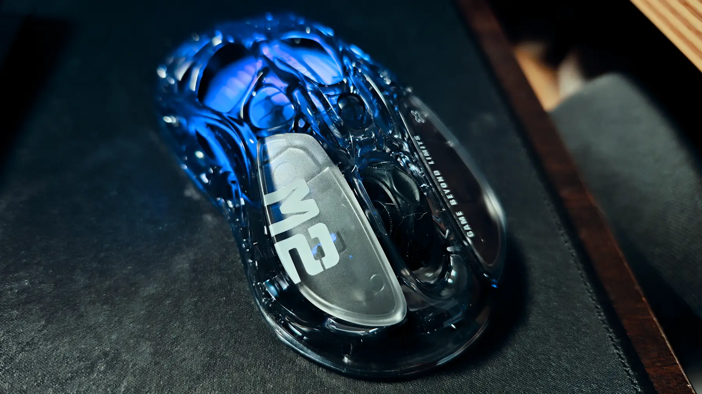

+++
title = "GravaStar Gaming Mouse Mercury M2"
description = "After four years with my previous mouse, I upgraded to the GravaStar Mercury M2, featuring a transparent black body and LED lighting. This gaming mouse offers a lightweight 79g design, three connection methods, and web-based configuration."
date = 2025-12-30
aliases = ["/articles/2025/12/30/mercury-m2"]
+++

## Replacing My Mouse

After four years of faithful service, my wired [Xtrfy M42](https://amzn.to/4qv3XfG) was showing its age. I considered buying the same model again, but it had been replaced by a newer version, and the old model was now expensive. I wasn't fond of the new Xtrfy designs, so I tried a [Kensington Slim Blade Pro](https://amzn.to/3MQsXQe) trackball instead. Unfortunately, it occasionally stopped responding, which became frustrating.

That's when I purchased the GravaStar [Mercury M2](https://amzn.to/44OXdB6) gaming mouse.

## Why I Chose the Mercury M2

GravaStar also offers a higher-end model, the [Mercury X Pro](https://amzn.to/3L4EESP), but since I don't game on my Mac, I decided the Mercury M2's specifications were sufficient.

The deciding factor was its unique design: a transparent black body with vibrant LED lighting. It has a cyberpunk aesthetic that serves as a striking accent on my desk.

## Key Features

**Connection Methods**

The mouse supports three types of connections:

- 2.4GHz USB receiver
- Bluetooth
- USB-C wired connection

Being able to switch between connection modes depending on the situation is convenient.

**Customization Settings**

No driver installation is required. On Mac, you can customize settings through a [web-based](https://controlhub.top/gravastar/) interface. You can adjust DPI, LED lighting patterns, and macro functions.

**Lightweight Design**

With an even more aggressive hollow body design than the M42, the Mercury M2 weighs only 79g. For a wireless mouse with a built-in battery, it's impressively light and comfortable for extended use. I'm slightly concerned about dust getting into the hollow body, but so far it hasn't been an issue.

## Conclusion

The Mercury M2 is a gaming mouse that combines distinctive design with practical functionality. Beyond gaming, it performs well as an everyday mouse. I'd recommend it to anyone looking for a lightweight wireless mouse with a design-forward aesthetic.
