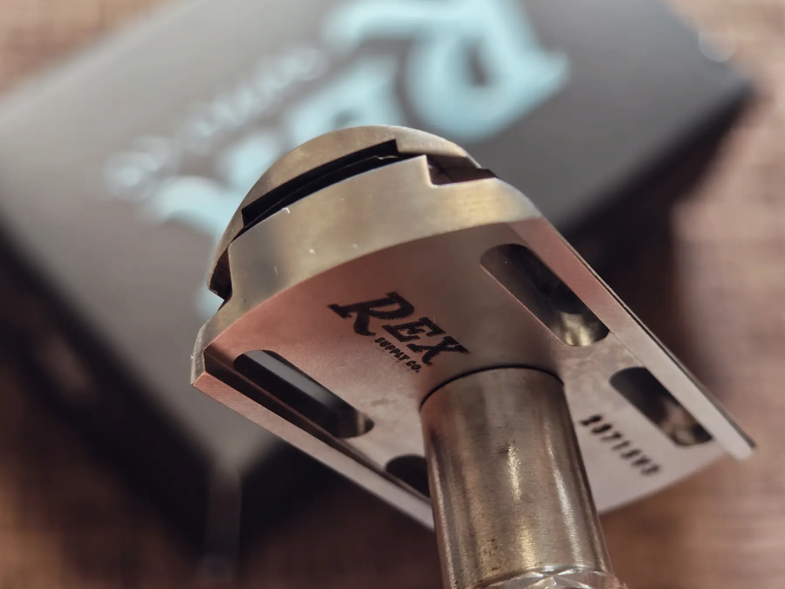
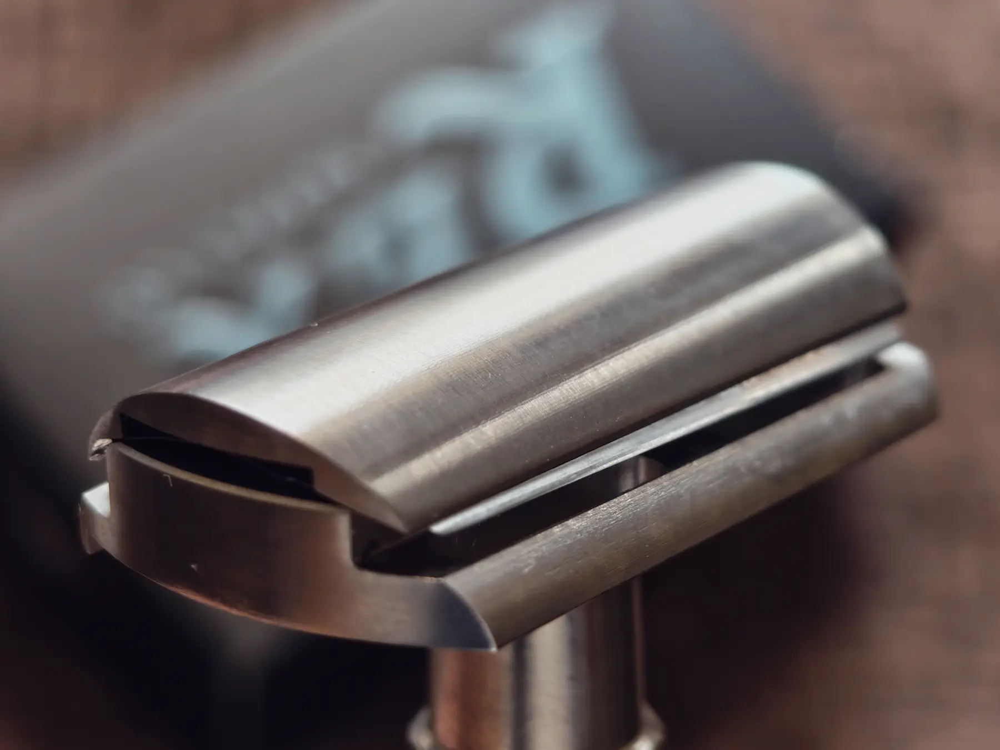

+++
title = "異次元のステンレス両刃カミソリ REX Sentry"
description = "米国REX Supply社のステンレス製両刃カミソリ「REX Sentry」のレビュー。極端なBlade Camberと微妙なSlant Presentationにより、マイルドでありながら深剃りが可能な独特の剃り味を実現。ギロチンから着想を得たという高精度なマリングレードステンレス加工により、一生ものの品質を誇る一本。"
date = 2025-12-19
aliases = ["/articles/2025/12/19/rex-sentry"]

[taxonomies]
tags = ["Gadget"]
+++

## 「スラント」両刃カミソリとは

一般的な両刃カミソリはホルダーに沿って刃をセットします。

しかし、一部の両刃カミソリでは次のように刃を特殊な状態でセットします。

<dl>
  <dt>刃を斜めに「配置」する(Slanted Presentation)</dt>
  <dd>
    ヘッド自体が斜め形状になっており、刃の露出位置（edge exposure /
    presentation）が左右で異なる。
  </dd>
  <dt>刃を「捻じる」(Torsion slant)</dt>
  <dd>
    刃の短辺方向にトルクをかけて固定することで切り刃がS字状（ねじれ）に湾曲。チャタリング（ビビり）の抑制。
  </dd>
</dl>

このいずれか、あるいは両方の特徴を備えた両刃カミソリは「スラント」と呼ばれ、
海外では割と一般的なようです。

例えば、メルクール37Cは上記の両方の特徴を備えた典型的な「スラント」です。

## REX Sentryとは

REX Sentryは米国のRex Supply社のものです。
ドイツ的な剃り文化を、アメリカ的CNC精度で再構築したメーカーです。

メルクールなどドイツのカミソリが真鍮にメッキが多いのに対して、REX Supplyではステンレスを高い精度で加工している点が特徴です。

購入したREX Sentryもマリングレード（船舶用）のステンレス鋼から巧みに作られています。そのデザインはフランスのギロチンのミリ単位の精度からインスピレーションを得たと恐ろしげな説明がなされています。
特徴は次の2点です。

- 極端なBlade Camber（刃の湾曲）がついている
- 微妙にSlanted Presentationである

前者のBlade Camberは、切り刃を押し下げて短辺全体が「∩」のような緩やかな弓形になるよう、刃にテンションが掛かった状態です。
これはどんなカミソリでも刃を安定させ肌に対して角度を付けるために必ず採用されています。
しかし、REX Sentryではこの湾曲が極端なのです。その結果、刃が肌に対して通常のカミソリより角度を持った状態で剃ることになります。

後者は左右で刃の露出が違うので、ホルダーを真っ直ぐに肌に当てても左右で角度が自然についている状態になります。

ドイツの伝統的なスラントと比較すると「捻じり」は採用されていません。

## REX Sentryの剃り味は?

かなりいかつい見た目と「ギロチン」にインスピレーションを得たというメーカーの売り文句に反して、
REX Sentryの剃り味はかなりマイルドです。

これは、極端なBlade Camberで肌へかなり刃を寝かせて当てることになるためです。
微妙なSlant Presentationにより左右にも角度が付いているので、Blade Camberの割にしっかりと深剃りできる印象です。

ホルダーにしっかり重量があるので、ホルダーの重さにまかせて脱力して剃れます。ホルダーの自重で剃れます。

1週間ほど使用しましたが、出血は一度もありません。
2パスでしっかり深剃りが可能です。

## まとめ

ずっと、フェザーの[特選オールステンレスレザー](https://amzn.to/4j2tgDj)を使ってきましたが、
重厚なヘッドと極端なBlade Camber、微妙なSlant Presentationから来る独特の剃り味から
すっかりREX Sentryに主役を入れ替えてしまいました。

メルクール37Cなど伝統的なドイツのスラントは切れ味が鋭すぎて気を使いますが、
REX Sentryは安心してスラントを楽しめ、一生ものの品質で作られているので
オススメです。
