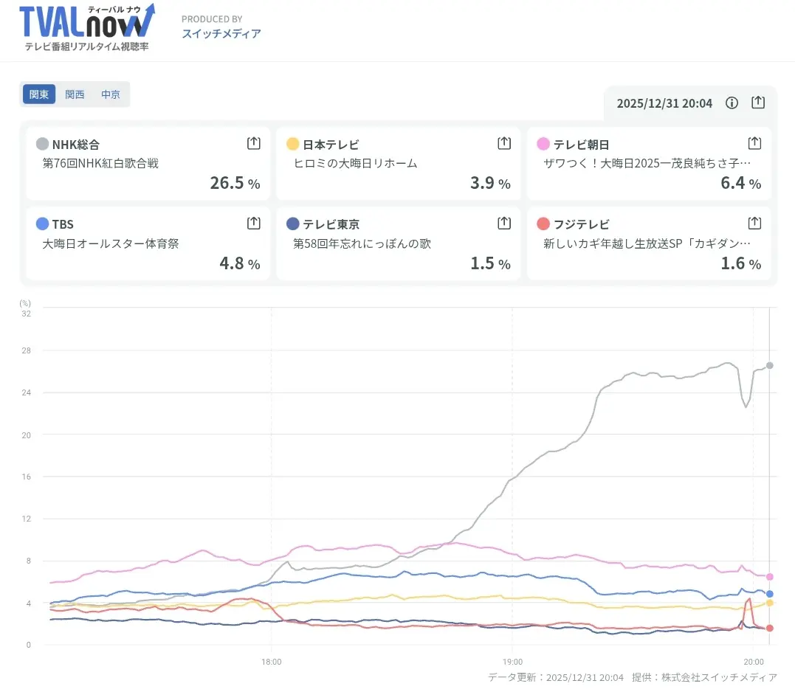

+++
title = "The aespa Controversy and NHK Kohaku Ratings Drop"
description = "Examining the controversy surrounding aespa's appearance on NHK's New Year's Eve music show and the coincidental viewership ratings decline."
date = 2026-01-01
aliases = ["/articles/2026/01/01/dirty-aespa"]
+++

## The Ratings Drop Mystery

Online rumors have been circulating that the approximately 4% viewership drop around 8 PM during NHK's New Year's Eve Kohaku music show corresponds to **aespa's** performance time. The group has been embroiled in controversy after posting images of atomic bomb mushroom cloud figures on X (formerly Twitter).

However, the reality is quite different and somewhat ironic. aespa's actual performance time was later in the evening. The time slot during this ratings dip was actually occupied by Time Machine 3's live broadcast from Kusatsu Onsen hot springs.

## The Broader Issue

Regardless of the timing discrepancy, I cannot forgive NHK's decision to feature this controversial group while ignoring the voices of many viewers. This is particularly insensitive given that the show's hosts, Hiroyuki Ariyoshi and Haruka Ayase, are both from Hiroshima.

The group's insensitive actions and NHK's controversial decision to feature them remain deeply problematic. This is true even if one considers that their behavior may stem from anti-Japanese education.

---

大晦日の紅白歌合戦の視聴率が20時前後で4%程度の落ち込んでいるのが、
日本への原爆投下のきのこ雲のフィギュアをx.comに投稿した問題で
炎上している**aespa**の出演時間だとネットではもっぱらの噂になっています。

まぁ、実際には出演時間帯はもう少し遅く、この落ち込んでいる時間帯は
タイムマシン3号が草津温泉から中継をやっていた時間帯で笑う。

しかし、反日教育されているとはいえ、あの非常識なグループと多くの視聴者の声を無視したNHKのことは、絶対に許しません。

だって、司会をやっていた有吉弘行と綾瀬はるかは広島出身だからな。

