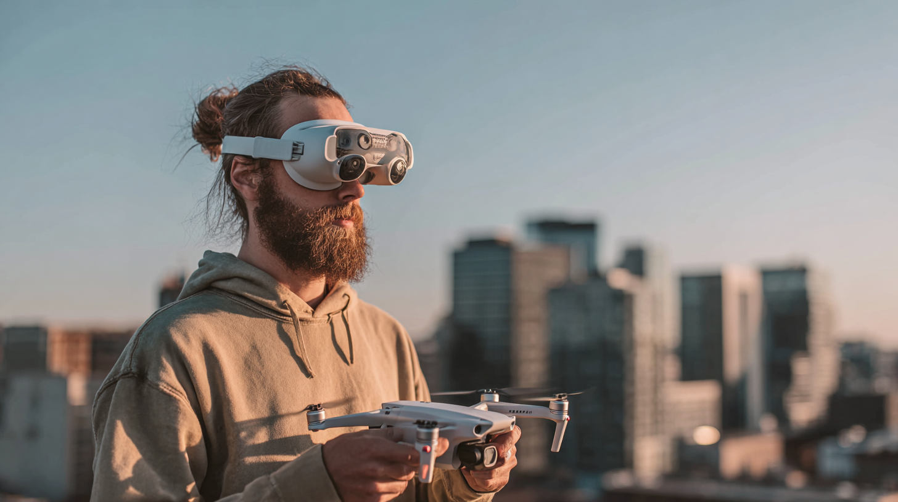

+++
title = "DJI機へのRemote IDインポート"
description = """
DJI NEOの修理後にRemote IDが消失。スマートフォンとの
互換性問題に直面しましたが、DJI RC 2を使用することで
解決できました。同じ問題に遭遇した方への解決策をご紹介します。
"""
date = 2026-01-20
aliases =["/articles/2026/01/20/dji-remote-id-import"]

[taxonomies]
tags =["Drone"]
+++

## 経緯

DJI NEOの機体が損傷したため、DJI Care Refreshを利用して修理しました。
シリアル番号は変わりませんでしたが、実際には機体交換していただいたのだと思います。

この際に当然ながらRemote IDが消えていました。

使用しているスマートフォン（Android）で、DJI Flyを起動してRemote IDのインポートを行おうとしたところ、
DIPS2.0へのログインで止まってしまいインポートが完了しませんでした。

## 原因

原因はDJI Flyとスマートフォンの互換性だと推定しています。

DJI NEO購入当初はGoogle Pixel8 Proを使用しており、何の問題もなくRemote IDをインポートできました。
しかし、昨年Pixel8 ProからNothing Phone(3)に移行していました。

普段の飛行には問題なく使用できていたため気にしていませんでしたが、[DJIの公式情報](https://repair.dji.com/help/content?customId=01700006560&spaceId=17&re=JP&lang=ja&documentType&paperDocType=ARTICLE)によると、Nothing Phone(3)は対応モバイル端末になく、Pixel8 Proは対象機種でした。Android端末の場合、全ての機種を検証できないという問題があるので記載がないから動作しないかは機種によると思いますが、掲載がない機種だとサポートでも対応してもらえません。

## 対応策

DJI NEOと接続できる機器はスマートフォン以外に以下がありますが、どれもRemote IDのインポートはできません。

- **DJI RC-N3 送信機** - スマートフォンを接続するタイプなので、スマートフォンの問題を解決できない
- **DJI Goggles N3** - DJIの機体ではゴーグルにRemote IDを書き込む機能を持たせていないようである
- **DJI FPV送信機 3** - 画面がないため、当然Remote IDのインポートはできない
- **DJI RC Motion 3** - 画面がないため、当然Remote IDのインポートはできない

私の場合は、DJI Air3SをDJI RC 2送信機を使って運用しているため、一時的にDJI RC 2にDJI NEOをペアリングしてRemote IDのインポートができました。

## まとめ

通常の使用では問題が出ていなかったので気にしていませんでしたが、特にAndroidの場合はDJI Flyとの互換性が問題になるケースがあるので要注意です。

また、Avata2のようにゴーグルとDJI FPV送信機3で運用している場合も、初期のRemote IDのインポートだけはスマートフォン上からDJI Flyアプリで行わざるを得ないので要注意です。
