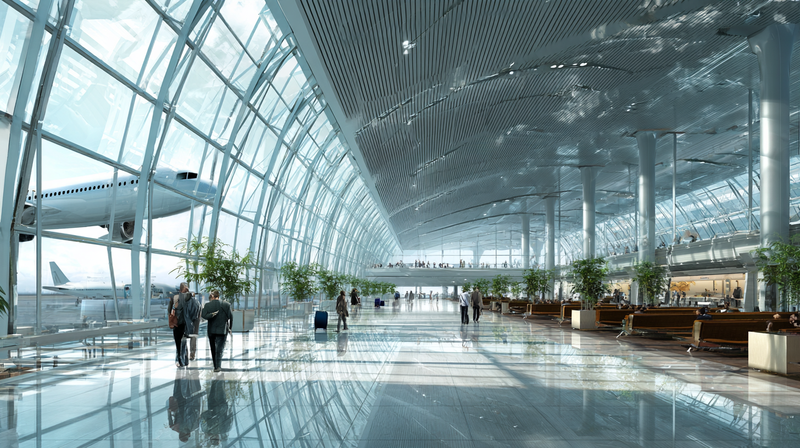

+++
title = "初めて海外出張へ行く君へ"
description = """
初めての海外出張が決まると、何を準備すればいいのか分からず
不安になるものです。通信手段やお金の管理など、
事前に整えておかないと現地で苦労する項目を中心に、
実務的な準備ポイントをまとめました。
"""
date = 2026-01-24
aliases =["/articles/2026/01/24/overseas-business-trip-essentials-for-newbies"]

[taxonomies]
tags =["Travel","Tips"]
+++

 

  
Table of Contents

  <!-- toc -->
  

## PCの持参と機内持ち込み

海外出張にノートPCは必須です。仕事はもちろん、現地でのコミュニケーションや情報収集にも欠かせません。
会社から特に指示がなくても、持参できるよう交渉することをお勧めします。

まず会社の規定を確認してください。企業によっては持ち出し可能な端末制限や事前申請が必要です。
もし会社のPCを持ち出せない場合は、私物のPCでも構わないので持っていくことを検討してください。

PCは必ず機内持ち込み手荷物にしてください。預け荷物にすることは、ほとんどの企業で規定により禁止されているはずです。
破損・盗難リスクやデータセキュリティ上の理由から、当然の措置といえます。

また、PCの扱いには細心の注意が必要です。機内だけでなく、仕事中やホテルでも常に手元に置いてください。
部屋へ置きっぱなしにするのは避けましょう。

空港のセキュリティチェックではPCをバッグから取り出す必要があります。
取り出しやすい場所に入れておくとスムーズです。

## 機内での座席選び

座席は後部の通路側を選ぶことをお勧めします。

通路側であれば、隣の人に気を遣うことなくトイレに立てます。
長時間のフライトでは水分補給が重要ですが、窓側に座ってしまうと「隣の人を起こしたくない」という心理からトイレを我慢しがちです。
結果として水分摂取を控えてしまい、体調を崩す原因になることeあります。

後部座席を勧める理由はもう1つあります。
国際線の機内最後尾には、多くの場合飲み物やスナックを自由に取れるギャレー（調理スペース）が用意されています。カップラーメンやお菓子、お酒や水などが用意されています。機内食の時間以外でも小腹が空いたときに気軽に利用できるでしょう。後部座席なら数歩で到着します。

## 海外でのデータ通信手段

現地でのインターネット接続手段を事前に確保しておくことは非常に重要です。
まず、会社で海外用のモバイルルーターを貸し出していないか確認してください。用意がある会社も多いです。

会社にない場合は、自分で手配します。主な選択肢は以下の2つです。

- ポケットWiFiレンタル
  - 空港や事前予約でレンタルできるモバイルルーター
  - 設定が簡単で、PCとスマホを同時接続できる
  - 端末の持ち歩きと充電が必要。紛失・破損時は弁償リスクあり
- eSIM
  - スマートフォンに直接データプランを追加する方式
  - 端末が増えず、アプリやWebで購入してすぐ使える
  - eSIM対応端末が必要。PCはテザリング経由で接続

短期間であればeSIMが手軽です。PCを頻繁に使う場合はポケットWiFiの方が便利かもしれません。

## スマートフォンの設定

海外で意図しない高額請求を避けるため、出発前にスマートフォンの設定を確認してください。

ポケットWiFiを使う場合は、国内SIMのモバイルデータ通信をオフにしてWiFi接続のみで運用します。
eSIMを使う場合は、国内SIMの回線を一時的に無効化し、eSIMのみを有効にしてください。

いずれの場合も、データローミングは必ずオフにしておきます。これを忘れると、知らないうちに国内キャリア経由で通信してしまい、帰国後に高額な請求を受ける可能性があります。

設定画面の場所はiPhoneとAndroidで異なります。

- iPhone：設定 → モバイル通信 → 通信のオプション → データローミング
- Android：設定 → ネットワークとインターネット → モバイルネットワーク → データローミング

出発前に自分の端末で設定場所を確認しておくと安心です。

## 充電器と電源

海外では電源コンセントの形状が日本と異なります。充電器と変換プラグを忘れずに持参してください。

### USB充電器

ノートPCの純正ACアダプターは大きくて重いため、USB PD対応の汎用充電器を持参することをお勧めします。
CIO NovaPort TRIO II 67Wは、USB-Cポート2つとUSB-Aポート1つを搭載し、
ノートPC・スマホ・モバイルバッテリーを同時に充電できます。
純正アダプターより大幅にコンパクトで、出張の荷物を減らせます。

最近のノートPCはUSB PD充電に対応しているものが多いですが、念のため出発前に自分のPCが対応しているか確認してください。
MacBookは全機種対応しています。

### モバイルバッテリー

モバイルバッテリーも忘れずに持参してください。
スマホはGrabやマップ、翻訳アプリなど現地で頻繁に使うため、バッテリー切れは致命的です。

信頼できるメーカーのものを選んでください。
安価な無名ブランド品は発火リスクがあり、機内での事故は致命的です。AnkerやCIOなど、品質管理がしっかりしたメーカーの製品をお勧めします。
容量は10,000mAh以上あると安心です。

なお、モバイルバッテリーは預け荷物に入れることができません。必ず機内持ち込み手荷物に入れてください。

### 変換プラグ

渡航先が決まっていない段階では、マルチタイプの変換プラグを用意しておくと安心です。
1台で世界中のほとんどの国に対応できます。

お勧めはカシムラのマルチ変換プラグです。
A・B・BF・C・O・SEタイプに対応し、50g未満と軽量で持ち運びに便利です。
エレコムやサンワサプライの製品も品質が安定しています。

変換プラグは電圧を変換しません。
使用する機器が海外の電圧（多くの国で220〜240V）に対応しているか確認してください。
最近のノートPCやスマホの充電器は「100〜240V」対応のものがほとんどです。
ヘアドライヤーなど日本専用の家電製品は変圧器なしで使えませんが、持っていくことは稀でしょう。

## 現金とカードの使い分け

海外での支払いは、基本的にクレジットカードを使うことをお勧めします。為替手数料も両替より有利な場合が多く、利用明細が残るので経費精算にも便利です。

現金は、屋台やタクシー、チップなど少額の支払い用に持っておく程度で十分です。1週間程度の出張であれば、4万円相当の現地通貨があれば困ることはないでしょう。

多くの場合、両替は空港よりも現地の銀行や両替所のレートが良いです。ただし、到着直後にタクシーや軽食で現金が必要になることもあるので、空港で5,000円程度は両替しておくと安心です。

トラベラーズチェックは現在ほとんど使われていないため、考慮する必要はありません。

### 配車アプリGrab

タイやシンガポールなど東南アジアではGrabという配車アプリが普及しています。スマホで車を呼び、アプリ上でカード決済ができるため、現金を使わずに移動できます。料金も事前に確定するので、ぼったくりの心配がありません。

出発前にアプリをインストールし、クレジットカードを登録しておくことをお勧めします。

- [Grab（iOS）](https://apps.apple.com/app/grab-taxi-food-delivery/id647268330)
- [Grab（Android）](https://play.google.com/store/apps/details?id=com.grabtaxi.passenger)

## チップについて

チップの習慣は渡航先によって大きく異なります。

アメリカでは飲食店やタクシーで15〜20%のチップが事実上必須ですが、アジア圏では基
本的に不要な国が多いです。中国・韓国・日本ではチップを渡す習慣がなく、渡すとかえ
って困惑されることもあります。

タイの場合は少し事情が異なり、以下のような場面では少額のチップを渡すことがありま
す。

- ホテルのポーターやベッドメイク：20〜50バーツ程度
- マッサージやスパ：50〜100バーツ程度
- 高級レストラン：サービス料が含まれていなければ端数を切り上げる程度

屋台やフードコート、コンビニなどではチップは不要です。タクシーも基本的には不要で
すが、お釣りの端数を渡す程度は喜ばれます。

チップは現金で渡すのが基本です。小額紙幣を用意しておくと便利です。なお、硬貨でチップを渡すのは失礼にあたるため、必ず紙幣で渡すようにしてください。

## 水と食事

海外では水道水を飲まないでください。ペットボトルの水を購入するのが基本です。レストランで出される氷も水道水から作られている場合があるので、心配なら氷なしで注文しましょう。

食事については、最初の数日は胃腸に負担をかけすぎないよう気をつけてください。屋台の料理は魅力的ですが、衛生面にばらつきがあります。火が通っているもの、人気があって回転の早い店を選ぶと比較的安心です。

## その他の備え

出発前に以下の準備も忘れずに行ってください。

- たびレジへの登録
  - 外務省が提供する海外旅行登録サービス
  - 登録すると渡航先の安全情報や緊急時の連絡がメールで届く
  - 3か月未満の短期渡航者は任意だが、登録を強く推奨
- パスポートの残存有効期間の確認
  - 国によっては入国時に6か月以上の残存有効期間が必要
  - 残存有効期間が1年未満の場合は新しいパスポートへの切り替えを検討
- パスポートと航空券のコピー
  - 紙のコピーと、クラウドストレージにデジタルコピーの両方を用意
  - 万が一紛失した際の再発行手続きがスムーズになる
- 海外旅行保険の確認
  - 会社の法人カードに付帯している場合が多いので、補償内容を確認
  - 付帯がない場合は個別に加入を検討
- 緊急連絡先の共有
  - 会社の緊急連絡先、現地の日本大使館・領事館の連絡先を控えておく
  - 家族にも滞在先ホテルや現地連絡先を伝えておく
- 常備薬の持参
  - 普段使用している薬があれば必ず持参
  - 胃腸薬や解熱鎮痛剤もあると安心
- 予防接種
  - 短期の都市部出張であれば通常不要
  - 心配な場合は出発2週間前までに渡航外来で相談

## 中国への出張について

最後に、中国への出張について触れておきます。

初めての海外出張で中国を打診された場合、可能であれば断ることをお勧めします。

現在の中国は地政学的リスクが非常に高く、日本人ビジネスパーソンにとって安全とは言
えない状況です。スパイ容疑での拘束事例も報告されており、何気ない行動が思わぬトラ
ブルにつながる可能性があります。

また、インターネット規制（グレートファイアウォール）によりGoogle、LINE、Gmailな
どが使えず、VPNの準備が必要になるなど、通信面でのハードルも高いです。決済も
WeChat PayやAlipayが主流で、外国人が使うには事前準備が必要です。

中国出張を避けられない場合は、会社のセキュリティ部門や法務部門に相談し、十分な対
策を講じてから渡航してください。初心者が単独で対応するには荷が重すぎます。

## 参考情報

この記事の作成にあたり、以下の情報を参考にしました。

- [外務省 海外安全ホームページ](https://www.anzen.mofa.go.jp/) - 各国の危険情報・安全対策
- [たびレジ（外務省海外旅行登録）](https://www.ezairyu.mofa.go.jp/tabireg/index.html) - 短期渡航者向け登録サービス
- [外務省 海外渡航・滞在](https://www.mofa.go.jp/mofaj/toko/index.html) - パスポート・ビザ情報
- [中国：反スパイ法に関する注意喚起（外務省）](https://www.anzen.mofa.go.jp/info/pcspotinfo_2025C029.html)
- [飛行機へ持ち込めないもの（政府広報オンライン）](https://www.gov-online.go.jp/article/201412/entry-7500.html)
- [Grab公式サイト](https://www.grab.com/global/rides/) - 東南アジアの配車アプリ
