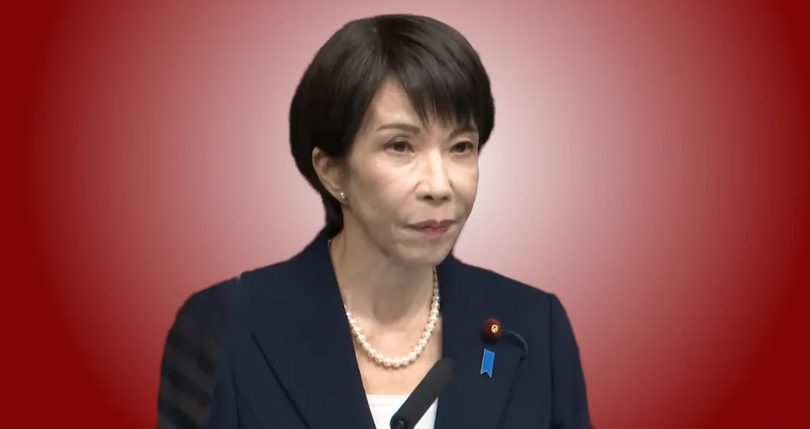

+++
title = "高市総理の衆議院解散表明 - 覚悟の政策転換"
description = "高市総理の衆議院解散表明に胸が震えました。これほど多岐にわたる具体的政策を掲げ、自らの進退を国民の判断に委ねた首相を、私は知りません。"
date = 2026-01-21
aliases = ["/articles/2026/01/21/takaichi-dissolution-speech"]

[taxonomies]
tags = ["Current Affairs"]
+++

<figure>
  
  <figcaption>高市早苗内閣総理大臣 記者会見</figcaption>
</figure>

2026年1月21日、高市早苗内閣総理大臣が衆議院解散を表明しました。

小泉首相の郵政解散は郵政民営化の賛否を問う単一争点でした。高市首相は違います。財政・安保・インテリジェンス・税制・憲法改正と、国家の根幹に関わる複数の大転換を、具体的な数字と制度設計にまで踏み込んで語りました。そして「高市早苗に国家経営を託していただけるのか」と、自らの進退を国民の判断に委ねました。**これほど多岐にわたる具体的政策を掲げ、自らの進退を賭けた首相は過去に例を見ません**。

{{ youtube(id="v6674b-RsfY") }}

[記者会見全文を読む](kaiken/)

## 評価できる点

### 明確な解散理由と覚悟の提示

高市首相は「政権選択選挙の洗礼を受けていない」という正統性の問題を自ら認め、国民に信を問う姿勢を示しました。「信なくば立たず」という原則に基づく論理的な解散理由であり、「高市早苗に国家経営を託していただけるのか」と自らの身体をかける覚悟を表明しています。

### 政策の具体性

経済財政政策の本丸として「責任ある積極財政」を掲げました。第一の柱は危機管理投資です。食料安全保障、エネルギー・資源安全保障、経済安全保障、国土強靱化といった分野への投資を進めます。第二の柱は成長投資で、戦略17分野を定め、新技術立国の実現と産業クラスターの形成を目指します。

具体的な数字も示されました。一世帯あたり年間8万円超の支援額、プライマリーバランスの28年ぶりの黒字化、新規国債発行額29.6兆円（リーマンショック後2番目に低い水準）といった数値です。

技術分野にも踏み込んでいます。ペロブスカイト太陽電池、小型モジュール炉（SMR）や次世代革新炉、フュージョンエネルギー、液浸冷却技術や光電融合技術、酸化物型全固体電池、完全閉鎖型植物工場や陸上養殖施設といった具体的な技術名を挙げました。

### 財政規律への配慮

「借金で新しい政策を実施するわけではない」と明言した点も重要です。成長率の範囲内に債務残高の伸び率を抑制し、政府債務残高の対GDP比を引き下げていくと目標を明示しています。「責任ある積極財政」として、積極財政と財政規律の両立を志向している点は評価できます。

### 安全保障政策の抜本強化

戦略三文書（国家安全保障戦略、国家防衛戦略、防衛力整備計画）の前倒し改定を表明しました。ウクライナ戦争後、各国は無人機の大量運用を含む新しい戦い方や長期戦への備えを急いでいます。これは前回戦略三文書を改定した2022年と比べて大きな変化であり、その改定は急務だという認識です。

具体的施策としては、抑止力のさらなる強化、サイバー・宇宙・電磁波など新領域への対応、防衛産業・技術基盤の強化、自衛官の処遇改善を挙げています。

### インテリジェンス機能の強化

この点は個人的に最も注目しています。G7諸国との比較で見ると、日本の現状は明らかに遅れています。

| 国       | スパイ防止関連法制   | 主要情報機関       |
| -------- | -------------------- | ------------------ |
| 米国     | Espionage Act等      | CIA、FBI、NSA      |
| 英国     | Official Secrets Act | MI5、MI6           |
| ドイツ   | 刑法典第94条等       | BfV、BND           |
| フランス | 刑法典411条等        | DGSI、DGSE         |
| 日本     | 具体的な法律なし     | 内調（権限限定的） |

高市首相は国家情報局の設置、対日外国投資委員会の設置、インテリジェンス・スパイ防止関連法の制定を掲げました。歴代首相が避けてきたこの課題に正面から取り組む姿勢は、地政学的リスクが高まる中で評価すべき点だと考えます。

### 選挙日程への配慮

予算成立への影響を最小化するため、最短日程を設定しました。1月23日に衆議院を解散し、1月27日に公示、2月8日に投開票という日程です。高校無償化・給食費無償化については暫定予算でも実現すると約束しています。

### 外交方針の明確化

「自由で開かれたインド太平洋」の進化を掲げ、日米同盟を基軸とした多国間連携を推進する方針を示しました。日米韓、日米フィリピン、日米オーストラリア、日本・イタリア・イギリスなどとの連携強化を進めます。拉致問題解決への意欲も表明しています。

## 過去の首相との比較

解散表明の具体性という観点で、過去の首相と比較してみました。

| 首相               | 解散名                     | 特徴                                         |
| ------------------ | -------------------------- | -------------------------------------------- |
| 小泉純一郎（2005） | 郵政解散                   | 「賛成か反対か」単一争点。明確だが範囲が狭い |
| 安倍晋三（2014）   | 消費税延期                 | 増税延期の是非を問う。限定的                 |
| 安倍晋三（2017）   | 国難突破                   | 北朝鮮情勢・消費税使途変更。抽象的           |
| 岸田文雄（2021）   | 就任直後                   | 「新しい資本主義」。具体性に欠ける           |
| 高市早苗（2026）   | 自分たちで未来をつくる選挙 | 多分野にわたる具体的政策転換を明示           |

### 高市首相の特異性

今回のスピーチで示されたコミットメントの範囲は極めて広いです。財政政策では予算編成手法の根本改革と複数年度コミットを掲げました。具体的数字としてPB28年ぶり黒字、国債29.6兆円、支援額8万円を示しました。技術分野ではペロブスカイト、SMR、フュージョン、全固体電池といった具体名を挙げました。制度面では国家情報局、対日外国投資委員会、スパイ防止法の新設を掲げました。安保改革として戦略三文書の前倒し改定、税制では飲食料品の消費税2年間免除、社会保障では給付付き税額控除の制度設計、そして皇室典範と日本国憲法の改正にまで言及しました。

これほど多岐にわたる具体的政策を解散表明で明示した首相は過去に例を見ません。

小泉首相は「明確さ」では際立っていましたが、争点は郵政民営化の一点でした。高市首相は経済財政・安全保障・インテリジェンス・税制・憲法と、国家の根幹に関わる複数の大転換を同時に掲げています。

「後で言い逃れできない」レベルで具体的に語っている点で、過去に例を見ない覚悟の表明だと感じました。

## 総評

高市首相の衆議院解散表明は、歴史的なスピーチだと評価できます。

第一に、正統性への誠実な向き合いです。政権選択選挙を経ていないことを自ら認め、信を問う姿勢を示しました。第二に、政策の具体性です。抽象的なスローガンではなく、数字・技術・制度を具体的に提示しました。第三に、覚悟の表明です。多岐にわたるコミットメントにより、後退の余地を自ら封じています。第四に、歴代首相が避けてきた課題への挑戦です。スパイ防止法、憲法改正といった困難な課題に正面から取り組む姿勢を示しました。

「日本列島を強く豊かに」というビジョンのもと、責任ある積極財政、安全保障の抜本強化、インテリジェンス機能の確立という三本柱を明確に打ち出しました。

> だから私は逃げません。ぶれません。決断します。未来に責任を持つ政治を貫いてまいります。

選挙の結果がどうなるかは分かりません。しかし、これほど明確に政策を掲げて信を問う姿勢は、日本の政治において久しく見なかったものだと思います。
