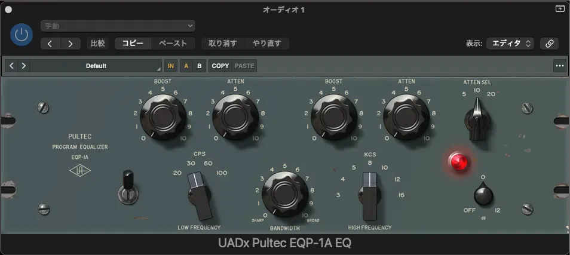
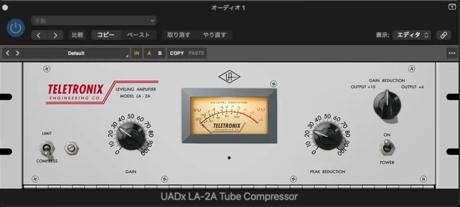
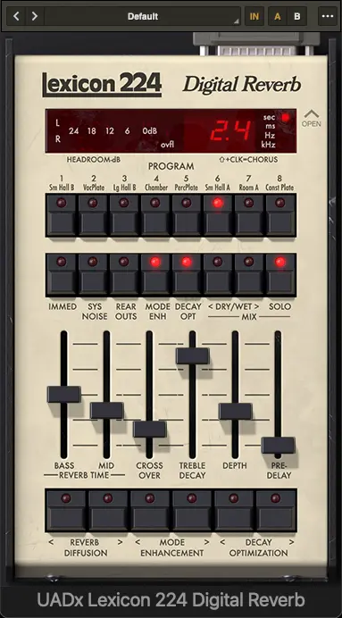
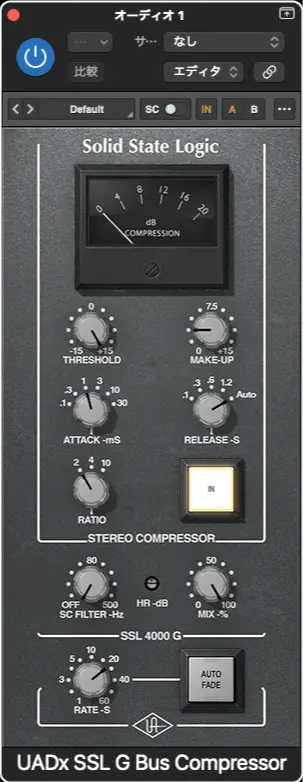
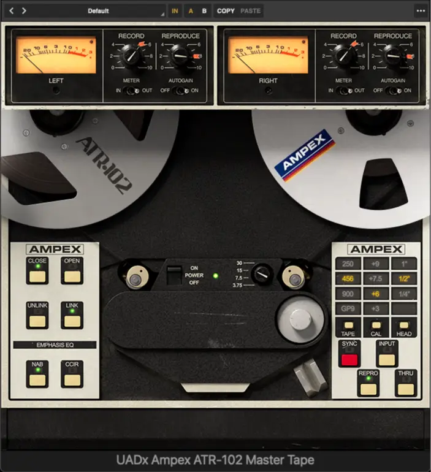

+++
title = "5つのクラシックUADプラグイン：黄金時代のスタジオレジェンド"
description = "Universal Audioのセールを活用して、マスタリング中心のプラグインコレクションを構築しました。今回購入した5つの伝説的なプラグイン—Pultec EQP-1A、LA-2A、Lexicon 224、SSL G Bus Compressor、Ampex ATR-102—について、ビートルズから1980年代ポップスまでの魅力的な歴史と、Logic Proで個別トラック、バス、マスターチャンネルでの実際の使い方を詳しく解説します。"
date = 2026-01-11
aliases = ["/articles/2026/01/11/universal-audio-plugins"]

[taxonomies]
tags = ["Music Production","Software"]
+++

I took advantage of Universal Audio's sale to build my mastering-focused plugin collection. Here's a deep dive into the 5 legendary plugins I picked up. These include the Pultec EQP-1A, LA-2A, and Lexicon 224. I also got the SSL G Bus Compressor and Ampex ATR-102. I'll cover their fascinating history from The Beatles to 1980s pop. You'll also learn exactly how to use each one in Logic Pro on individual tracks, buses, or the master channel for professional results.

## The Plugins I Purchased

### Pultec EQP-1A

Developed by Pulse Techniques in 1951, the EQP-1A has been cherished for over 70 years as the most musical passive equalizer. Its unique design combining tube amplification with passive components prevents phase distortion even when boosting or cutting, creating a beautiful harmonic enhancement effect.

The famous "low-end trick" of simultaneously boosting and cutting the low frequencies is widely known as a technique for adding both punch and clarity to kicks and bass. It has been used across generations, from The Beatles to modern hip-hop.

**In Logic Pro**, the Pultec EQP-1A is extremely versatile and can be used at multiple stages of production. As an **Audio FX insert on individual tracks**, it excels at shaping kick drums and bass guitars with the famous "low-end trick," adding clarity while maintaining weight. On vocal tracks, gentle high-frequency boosts add air and presence without harshness. The EQP-1A is also highly effective on **instrument buses** (such as drum buses or vocal buses), adding cohesive tonal shaping across grouped elements. Additionally, many mastering engineers use it on the final **master track** to add subtle sweetness and harmonic richness to the entire mix. The UAD plugin collection includes the HLF-3C for high frequencies and MEQ-5 for midrange, extending the Pultec family's sonic palette across the frequency spectrum.

### LA-2A Tube Compressor

Released by Teletronix in 1965, the LA-2A is a legendary compressor combining tube amplification with a T4 optical element. Its unique operation with automatically adjusted attack and release times achieves extremely natural and musical compression for vocals, bass, and guitar. Particularly for vocal processing, it has been beloved for nearly 60 years as "smooth and transparent compression," used on countless classic albums from Motown to modern pop. Despite its simple operation, the sound quality it delivers is irreplaceable.

**In Logic Pro**, the LA-2A excels primarily as an **Audio FX insert on individual tracks**.
The most common application is on lead vocals, gently controlling dynamics while maintaining presence and clarity.
It's also highly effective on bass guitar tracks, adding sustain and consistency without making the tone sound over-compressed.
For acoustic guitars and electric guitar solos, the LA-2A provides a musical cohesion that naturally blends the performance into the mix.
Some engineers use it on a **vocal bus** for group processing when handling background vocals or vocal stacks, applying gentle glue compression across multiple vocal tracks.
Unlike mix bus compressors, the LA-2A is rarely used on the master track.
Its characteristics are best showcased when applied to specific sources rather than the entire mix.

### Lexicon 224 Digital Reverb

Introduced in 1978, the Lexicon 224 revolutionized music production as the world's first commercial digital reverb. It achieved precisely controlled spatial representation that was impossible with previous plate or spring reverbs. This created the rich and expansive reverb that characterized 1980s pop, rock, and fusion sounds. The "sparkling and three-dimensional reverberation" when used on drums and vocals became an iconic sound of that era.

**In Logic Pro**, the Lexicon 224 is most effectively used as a **send effect on an Aux track**. Create an Aux channel and insert the Lexicon 224 as an Audio FX. Then use send controls to route multiple tracks (vocals, drums, guitars) to this reverb bus. This approach allows independent blending of wet reverb signal and dry source signal for each track. It enables precise control of spatial depth and placement.

The most common applications include drum overheads and room mics for creating classic 1980s drum ambience. Lead and background vocals benefit from added depth and dimension. Guitar solos and synth pads can create vast soundscapes. Using reverb on an Aux track (rather than as an insert) also conserves CPU resources. Multiple tracks can share the same reverb instance. Some engineers use the Lexicon 224 on **dedicated reverb buses for specific instruments** (such as "Drum Reverb" or "Vocal Reverb"). This enables different reverb settings for different sonic elements in the mix.

### SSL G Bus Compressor

In the 1980s, the master bus compressor installed in the SSL 4000 G Series console established a legendary status. It became known as equipment that imparts a "glue" effect to the entire mix.
Despite its modest ratio settings, it excels at integrating the entire mix into a cohesive single sound image. It's particularly powerful in rock, pop, and dance music.
The effect of creating punch and cohesion simply by inserting it on the stereo bus is called "SSL Glue" and has become an indispensable technique in modern mixing.

**In Logic Pro**, the SSL G Bus Compressor is primarily used on the **Stereo Out (master track)**.
As its name suggests, it's inserted as one of the final processors in the master chain, bringing the entire mix together.
Typically used with gentle settings (2:1 or 4:1 ratio, slow attack, auto release) to achieve 1-3 dB of gain reduction.
Many engineers insert this early in the mixing process, "mixing into the compressor," allowing the compressor to shape mixing decisions from the start.
The SSL G Bus Compressor is also effective on **submix buses**. On drum buses, it can add punch and cohesion when kick, snare, and other drum elements work together.
It's also commonly used on instrument group buses (all guitars, all synths, background vocals) to create a more unified sound within each section.
Unlike individual track compressors like the LA-2A, the SSL G Bus Compressor reveals its true value in processing multiple elements simultaneously. It's not suitable for application to single tracks.

### Ampex ATR-102 Mastering Tape Recorder

Introduced in the late 1970s, the Ampex ATR-102 is known as the pinnacle of 2-track mastering tape recorders. Through its unique sonic characteristics of tape saturation, tape compression, and high-frequency roll-off, it adds warmth and depth lacking in digital recordings. Many engineers have passed tracks through this equipment in the final mastering stage, imparting cohesion and a "glue-like" effect to the entire work. The UAD emulation also allows selection of tape speed (15/30 ips) and tape type.

**In Logic Pro**, the Ampex ATR-102 is almost exclusively used on the **Stereo Out (master track)**, placed as the final processor in the signal chain or very close to it.
Insert it after the mix bus compressor and EQ, before the final limiter or metering plugin.
Tape emulation provides subtle analog saturation and gentle compression effects.
As a result, it helps the mix feel more cohesive and "finished."

Typical settings include **15 ips** for warmer, more saturated characteristics emphasizing low-end bloom, or **30 ips** for cleaner, more transparent tape sound achieving tight low-frequency response.
The choice of tape formulation (GP9, 456, 900) further shapes tonal character and saturation behavior.
Some mixing engineers use the ATR-102 on submix buses (such as drum buses or instrument buses),
adding analog character to specific elements before they reach the master fader.

However, its primary purpose is processing in the final mastering stage, providing the "analog finish" typical of digital production.

## Summary

These five Universal Audio plugins represent different eras of studio technology, but when used together they form a comprehensive toolkit for modern music production. Understanding where each plugin fits in the signal flow is key to using them effectively.

**Individual Track Processing (Audio FX)**

- Start with Pultec EQP-1A for tonal shaping of kick drums, bass, and vocals
- Follow with LA-2A for natural, musical compression on vocals, bass, and guitars

**Group Processing (Buses)**

- Use Pultec on instrument buses (drum bus, vocal bus) to add cohesive tonal character
- Apply SSL G Bus Compressor to submix buses for punch and glue
- Send multiple sources to Lexicon 224 on an Aux track for shared spatial processing

**Mix Finishing (Master Track)**

- Insert SSL G Bus Compressor early in the master chain for overall mix cohesion
- Add Pultec for final tonal sweetness and harmonic enhancement
- Finish with Ampex ATR-102 as the final "analog finish" before limiting

What makes Universal Audio's emulations special is not just their sonic accuracy, but how they encourage you to work in the way professional studios have for decades. Each plugin embodies decades of engineering wisdom in its design, teaching you not just what sounds good, but why it sounds good.

Building this mastering-focused collection by taking advantage of UAD's sale was a worthwhile investment. These aren't just plugins—they're tools that connect modern digital workflows to the golden age of analog recording, bringing warmth, character, and musicality to every project.
