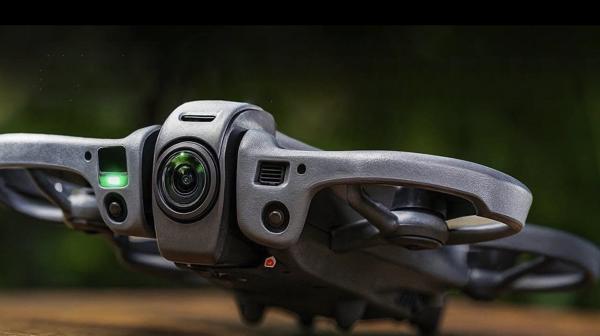

+++
title = "DJI Avata 360、3月発売が濃厚に"
description = """\
DJI Avata 360の正式発表が近づいています。\
ベータアプリからインストラクション動画が発見され、\
レビュアーへの実機配布も始まっているようです。\
FPVと360度撮影を一台に統合した注目機体の\
リーク情報を整理します。
"""
date = 2026-02-18T00:00:00+09:00
draft = true
[taxonomies]
tags = ["Drone"]
[extra]
social_media_card = "ogp.webp"
+++

<!-- textlint-disable -->

Table of Contents

<!-- toc -->

<!-- more -->

DJI Avata 2の後継機である
DJI Avata 360の正式発表がいよいよ近づいてきました。
かなり具体的な発売時期についての情報が出てきたようです。

## 発売時期

当初は2025年末の発売が予想されていましたが、
2026年2月に延期、さらに配送上の問題で再延期と、
何度も延期を繰り返してきました。

今回 DroneXLのJasper Ellens氏が2月14日に報じたところに
よると、DJI Gogglesのベータソフトウェアから
Avata 360のインストラクション動画が発見され、
レビュアーには既に実機が配布されているとのことです。

今回ベータアプリに
インストラクション動画が組み込まれていた点と、
レビュアーへの実機配布が始まっている点は、
発表直前の準備段階に入ったことを示しています。

現時点のリーク情報では、**2026年3月に中国で先行発売、
その後数週間以内にグローバル展開**
という流れが
見込まれています。

## FPVと360度カメラの統合

Avata 360の最大の特徴は、FPVドローンに360度カメラを
統合した点です。DJIのプロモーション文には
「Fly first and frame later（まず飛ばして、
後から構図を決める）」とあり、先行する
Insta360 Antigravity A1に対するDJIの回答と
いえる製品です。

| 項目 | Avata 360（リーク） | Antigravity A1 |
| --- | :---: | :---: |
| 配置 | 上下2基 | 上下2基 |
| センサーサイズ | 未公表 | 1/1.28" |
| 解像度（360°） | 8K/60fps | 8K/30fps |
| HDR | 対応 | 非対応 |

フレームレートとHDRではAvata 360が上回りますが、
センサーサイズが未公表な点は気になるところです。

## リーク情報のまとめ

以前からリークされているスペックと価格を
まとめておきます。正式発表前のため、
製品版で変更される可能性があります。

| 項目 | Avata 360（リーク） | Antigravity A1 | Avata 2（参考） |
| --- | :---: | :---: | :---: |
| 映像 | 8K/60fps HDR（360°） | 8K/30fps（360°） | 4K/120fps |
| センサー | 上下2基（サイズ未公表） | 上下2基（1/1.28"） | 1基 |
| 重量 | 377g以上の見込み | 249g | 377g |
| 飛行時間 | 未公表 | 24分〜39分 | 約23分 |
| 障害物検知 | 前方4〜6基 | 前方+下方 | 前方+下方 |
| コントローラー | Goggles N3 / RC2 | Grip + Vision | 同左（Avata 360） |

映像性能ではAvata 360にアドバンテージがありますが、
249gという軽量さと最大39分の飛行時間は
Antigravity A1の強みです。

中国市場向けの価格表もリークされています。
Avata 2発売時の価格を踏襲するとみられ、
予想価格は以下のとおりです。

| バンドル | Avata 360（予想） | Antigravity A1 |
| --- | :---: | :---: |
| 機体のみ | 約$435 | — |
| 標準バンドル | 約$575（RC2） | — |
| Fly More Combo | 約$999 | $1,599（Grip + Vision） |
| Goggles N3 Combo | 約$825 | — |

Antigravity A1はGripモーションコントローラーと
Visionゴーグルのセットで$1,599からです。
スティック型コントローラーには対応していません。
Avata 360はGoggles N3やRC2との互換性が維持される
ため、既にDJIのエコシステムを持っているユーザーは
機体だけ購入すればよく、価格面で大きな
アドバンテージがあります。

## まとめ

Avata 2ユーザーとしては、既存のゴーグルと
コントローラーがそのまま使え、360度撮影という
新しい可能性が加わる点が魅力です。3月の正式発表を
楽しみに待ちたいと思います。

<!-- textlint-enable -->
