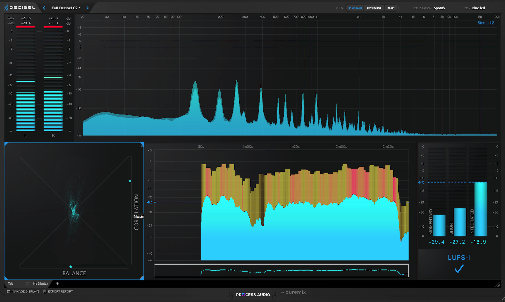
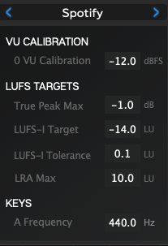

+++
title = "Process.audio Decibelを導入した — マスタリングのメータリング環境構築"
description = """
Process.audio DecibelとWaves L4 Ultramaximizerを導入し、
女性ボーカルとピアノの楽曲をマスタリングしました。
UADxプラグインによるシグナルチェインの設計から、
ダイナミクスを活かしたリミッティングの考え方まで、
実際のセッションで得た知見を共有します。
"""
date = 2026-02-23
[taxonomies]
tags = ["Music", "Music Production"]
[extra]
social_media_card = "ogp.webp"
+++

Table of Contents

<!-- toc -->

## はじめに

女性ボーカルとピアノだけのシンプルな構成の楽曲を
マスタリングしました。
ピアノはRavel、ヴォーカルはSynthesizer Vです。
プラグインはUADxを中心に、最終段のリミッターには
先日導入したWaves L4 Ultramaximizer、
メータリングには今回新たに導入した
Process.audio Decibelを使っています。

<iframe width="100%" height="166" scrolling="no" frameborder="no" allow="autoplay" src="https://w.soundcloud.com/player/?url=https%3A//api.soundcloud.com/tracks/soundcloud%253Atracks%253A2271481283&color=%23ff5500&auto_play=false&hide_related=false&show_comments=true&show_user=true&show_reposts=false&show_teaser=true"></iframe>
<a href="https://soundcloud.com/yostos" title="Yostos" target="_blank" style="color: #cccccc; text-decoration: none;">Yostos</a> · <a href="https://soundcloud.com/yostos/homura" title="Homura" target="_blank" style="color: #cccccc; text-decoration: none;">Homura</a>

## ミックスの概要

ボーカルはPultec EQで周波数を整えてから
1176 Rev Aで軽くコンプレッションをかけ、
Pure Plate Reverbを薄めにセンドしています。

ピアノは左手と右手を別トラックにして、
客席目線でR30/L30にパンニングしています。
右手はEQP-1Aで高域に空気感を足し、
左手はHLF-3Cで高域をカットして棲み分けを
作っています。コンプレッションは両方ともLA-2Aで、
ピアノのダイナミクスを壊さない穏やかな設定です。
リバーブはボーカルのプレートとは別に、
Lexicon 224のホールを使って空間を分けています。

マスターバスはPultec MEQ-5で中域を微調整し、
SSL G Bus Compressorで軽くグルーをかけてから、
Ampex ATR-102でテープサチュレーションを
加えています。
ここまでが従来のチェインで、
この先に今回の主役であるL4とDecibelが入ります。

## L4 UltramaximizerとTrue Peak

最終段のリミッターにはWaves L4 Ultramaximizerを
使っています。ただし、今回はラウドネスを
稼ぐための使い方ではありません。

設定はCeiling -1.1dB、Thresholdは-1.5dBで、
True PeakモードをON、Oversamplingは16xに
しています。Ceilingを-1.0dBではなく-1.1dBに
したのは、DecibelのTrue Peak測定が厳格で、
-1.0dBだとギリギリ超えることがあったためです。

ピアノは楽器の特性上、
大きなダイナミックピークが発生します。
これを無理にリミッティングで潰そうとすると
（たとえばAttenuationが14dBも入るような状態）、
演奏のニュアンスが台無しになります。
いくつかのピークがリミッターに強く当たるのは
許容して、ダイナミクスを活かすことを
優先しました。
このジャンルでは、ラウドネスターゲットを
正確に満たすことよりも、
演奏の表現力を守るほうが大切です。

## Process.audio Decibelの導入

メータリングプラグインとして、
Process.audio Decibelを導入しました。
iZotope Insight 2の代替として検討し、
今回のセッションから使い始めています。

Decibelは1画面でLUFS-I、True Peak、
ダイナミックレンジ、コリレーション、
周波数スペクトラムを確認できます。
ストリーミングプラットフォームごとの
プリセットが用意されていて、
今回はSpotifyプリセットを使いました。
True Peak Max -1.0dB、LUFS-I Target -14.0、
LRA Max 10.0といったターゲットが設定されており、
PASS/FAILインジケーターで
基準を満たしているかが一目でわかります。

同じネットワークにいるiPadやiPhone、
Androidデバイスにメーター画面を
リアルタイム表示できるのも便利です。
Decibel Displayという無料アプリを入れて
IPアドレスを指定するだけで、
手元のタブレットがメーターディスプレイになります。
iZotopeの値上げもあり乗り換えを検討しましたが、
実際に使ってみるとマスタリング作業には
十分な機能を備えていました。

今回の楽曲の最終測定値は次の通りです。

- Integrated LUFS: -14.0
- True Peak MAX: -1.0 dBTP
- TRUEDYN: 11.5 dB

Spotifyのターゲットである-14 LUFSに
収まっています。

## バウンスとFLAC変換

Logic Proからのバウンスは24bit AIFFで行い、
L4のDither設定も24bitに合わせています。
32bit floatでバウンスすると
L4のディザリングが無意味になるので、
ビット深度を揃えることが重要です。

FLAC変換にはffmpegを使っていますが、
DAWでマスタリング済みの音源には
`ffmpeg -c:a flac`だけで変換します。
loudnormフィルターは未マスタリング音源用の
オプションとして残しつつ、
マスタリング済みのものには適用しません。

## まとめ

Process.audio Decibelの導入で、
L4 Ultramaximizerと合わせて
マスタリングのツールチェインが整ってきました。
ラウドネスメーターとリミッターが揃ったことで、
「測定→調整→確認」のワークフローが
スムーズに回っています。

女性ボーカルとピアノという
シンプルな編成だからこそ、
ダイナミクスの扱い方や周波数の棲み分けが
そのまま音に出ます。
リミッターで潰すのではなく、
演奏のニュアンスを活かす方向で
マスタリングできたのは良かったと思います。

## 参考リンク

- [Process.audio Decibel](https://process.audio/en/products/decibel)
- [Waves L4 Ultramaximizer](https://www.waves.com/plugins/l4-ultramaximizer)
- [Universal Audio](https://www.uaudio.com/)
